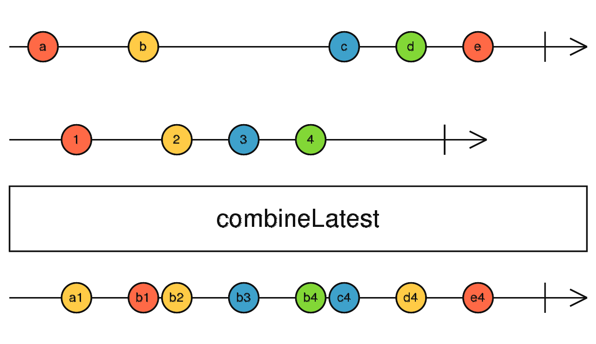
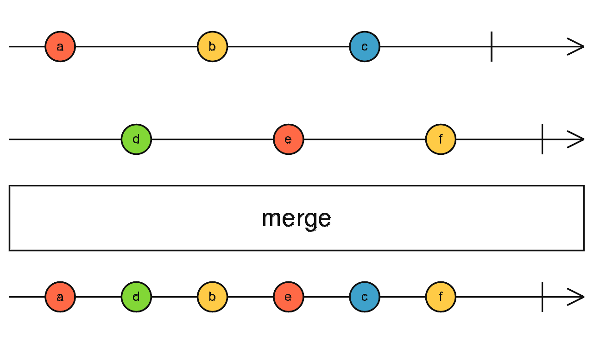
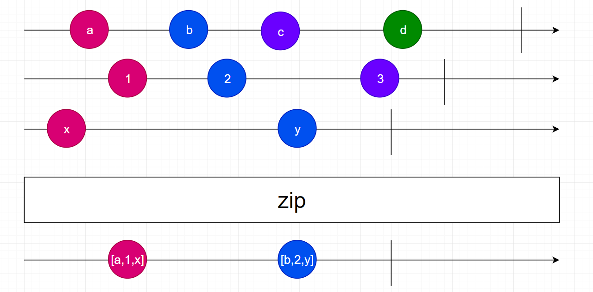
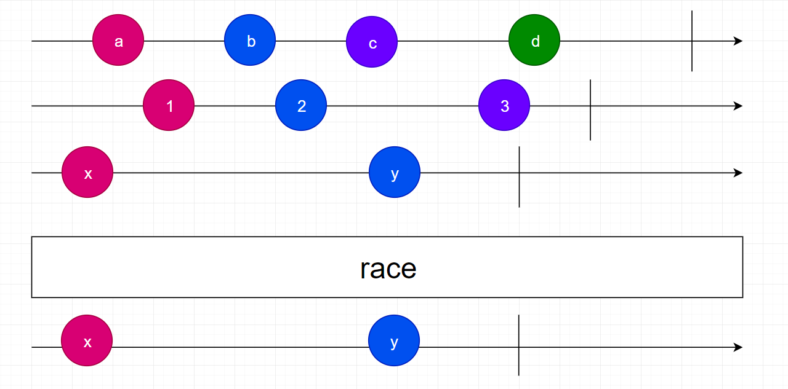

### rxjs核心概念

+ Observable 可观察对象，主要方法有subscribe,pipe
+ Observer 观察者，主要方法有next,error,complete
  + 实现类Subscriber
+ Subscription 订阅可观察对象之后返回的对象，用来终止订阅,主要方法有unsubscribe
+ Subject 主题，一种特殊的可观察对象，既是可观察对象，又是观察者，允许多播，与Observable的区别是Subject共享执行环境，Observable每次订阅都会创建新的执行环境
   + BehaviorSubject 保存最后一个值，当有新的观察者订阅主题时，立即发送最后一个值
   + ReplaySubject 类似BehaviorSubject，可设定最大记录多少个值，也可以设置一个窗口时间，最长记录多久之前的值
   + AsyncSubject 仅会complete后，推送执行环境中的最后一个值

### Observable与Promise互相转换

+ Promise->Observable 通过from操作符

```typescript

import { from } from 'rxjs';

const observable = from(
  new Promise(resolove => {
    resolove();
  }),
);

```

+ Observable->Promise 通过toPromise方法

```typescript

import { of } from 'rxjs';

const promise = of(1).toPromise();

```

### 创建Observable

+ 通过构造方法创建

```typescript

import { Observable } from 'rxjs';

const observable = new Observable(subscriber => {
  try {
    subscriber.next(1);
    subscriber.next(2);
    subscriber.next(3);
    subscriber.next(4);
    subscriber.complete();
  } catch (error) {
    subscriber.error(error);
  }
});

```
+ from操作符

```typescript

import { from } from 'rxjs';

const array = [10, 20, 30];
const result = from(array);

result.subscribe(x => console.log(x));
// result:
// '10'
// '20'
// '30'

```

+ of操作符,of与from的不同之处是of不会把参数展平，会直接把每个参数发射

```typescript

import { of } from 'rxjs';
 
of(10, 20, 30).subscribe(x => console.log(x));
// result:
// '10'
// '20'
// '30'
of([10, 20, 30]).subscribe(x => console.log(x));
// result:
// '[10,20,30]'

```

+ range操作符,range(start,count?)

```typescript

import { range } from 'rxjs';

const numbers = range(1, 3);
numbers.subscribe(x => console.log(x));
// result:
// '1'
// '2'
// '3'

```
+ interval操作符，定时器，每隔一定时间产生一个值

```typescript

import { interval } from 'rxjs';

const numbers = interval(1000);
numbers.subscribe(x => console.log(x));
// result:
// '0'
// '1'
// '2'
// '3'
// ...

```

+ timer操作符，类似interval，但是第一个参数可传一个延迟时间

```typescript

import { timer } from 'rxjs';

const numbers = timer(3000, 1000);
numbers.subscribe(x => console.log(x));
// result:
// '0' 3秒之后开始输出
// '1'
// '2'
// '3'
// ...

```

+ fromEvent操作符，将dom事件转成可观察对象，推荐使用此方法处理dom事件

```typescript

import { fromEvent } from 'rxjs';

const clicks = fromEvent(document, 'click');
clicks.subscribe(x => console.log(x));

```

+ throwError操作符，抛出错误

```typescript

import { throwError, concat, of } from 'rxjs';

const result = concat(of(7), throwError(new Error('oops!')));
result.subscribe(x => console.log(x), e => console.error(e));

// Logs:
// 7
// Error: oops!

```

+ defer操作符，延迟创建可观察对象，传入一个返回可观察对象的工场方法，当被订阅时才会调用工场方法

```typescript

import { defer, fromEvent, interval } from 'rxjs';
 
const clicksOrInterval = defer(function () {
  return Math.random() > 0.5
    ? fromEvent(document, 'click')
    : interval(1000);
});
clicksOrInterval.subscribe(x => console.log(x));
 
// Results in the following behavior:
// If the result of Math.random() is greater than 0.5 it will listen
// for clicks anywhere on the "document"; when document is clicked it
// will log a MouseEvent object to the console. If the result is less
// than 0.5 it will emit ascending numbers, one every second(1000ms).

```

+ iif操作符，在被订阅时决定哪个可观察对象被订阅，有些类似defer

```typescript

import { iif, of } from 'rxjs';
 
let subscribeToFirst;
const firstOrSecond = iif(
  () => subscribeToFirst,
  of('first'),
  of('second'),
);
 
subscribeToFirst = true;
firstOrSecond.subscribe(value => console.log(value));
 
// Logs:
// "first"
 
subscribeToFirst = false;
firstOrSecond.subscribe(value => console.log(value));
 
// Logs:
// "second"

```

+ EMPTY常量、NEVER常量(这两个的操作符已被弃用)，都返回空的Observable，区别是empty立即complete，never永远不会complete

```typescript

import { EMPTY, NEVER } from 'rxjs';

EMPTY.subscribe({
  next: x => console.log(x),
  complete: () => {
    console.log('empty complete');
  },
});
NEVER.subscribe({
  next: x => console.log(x),
  complete: () => {
    console.log('never complete');
  },
});
// result:
// 'empty complete'

```

### 连接创建操作符

+ combineLatest 并行执行多个Observable，用每个Observable的最新值组成一个数组并发射


+ concat 串行执行多个Observable，前一个Observable完成才会执行下一个，并发射每个Obserable的值(参数不要传数组)


+ forkJoin 并行执行多个Observable，当所有Observable都完成时，将最新值组成一个数组并发射


+ merge 并行执行多个Observable，并发射每个Obserable的值(参数不要传数组)


+ zip 并行执行多个Observable，用每个Observable的相同下标的值组成一个数组并发射(参数不要传数组)
  

+ race 多个Observable赛跑，返回第一个发射值的Observable


### 常用管道操作符

高阶Observable就是Observable套Observable

+ 转换型操作符
   + map 映射，map(x => x*10)
   + mapTo 所有的值都映射到一个结果，mapTo(10)
   + reduce 类似Array的reduce方法，当源流完成时发射最终结果，reduce((prev, item) => prev + item, seed)
   + scan 类似reduce，但是源流每发射一个值，都会发射一个中间值，scan((prev, item) => prev + item, seed)
   + combineAll
   + concatAll 将高阶Observable展平为低阶Observable，内部Observable完成后外部Observable才能触发下一个
   + mergeAll 类似concatAll，外部发射值时，内部Observable可以同时发射值
   + exhaust
   + switchAll
   + concatMap 相当于concatAll+map
   + mergeMap 相当于mergeAll+map
   + flatMap 
   + exhaustMap
   + switchMap 相当于switchAll+map

+ 过滤型操作符
   + filter 过滤，filter(x => x === 10)
   + skip 跳过，传入一个number，skip(5)
   + skipUntil 跳过，传入一个Observable，直到这个Observable发射一个值，之前的都跳过
   + take 拾取，传入一个number，take(5)
   + takeUntil 拾取，传入一个Observable，直到这个Observable发射一个值，之后的都舍弃
   + debounceTime 防抖，接到一个值之后等待一定的时间，如果有新的值发射，重新计算等待时间
   + throttleTime 节流，接到第一个值之后立即发射，然后进入等待期，再发射此期间的最新值
   + auditTime 类似节流，但是不会立即发射第一个值，直接进入等待期

+ 工具型操作符
   + tap 拦截每一个源值，可做一些操作，与map不同的是不会改变源值
   + delay 延迟执行
   + timeout 超时，如果给定时间内源没有发射值，订阅者会收到error

+ 错误处理操作符
   + catchError 捕获错误
